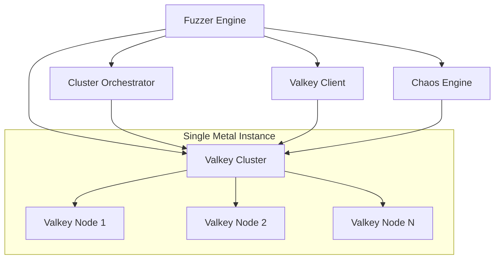

# valkey-fuzzer

A comprehensive testing framework designed to validate and test the robustness of Valkey through automated chaos engineering and randomized testing scenarios.

## Overview

valkey-fuzzer helps identify bugs that are difficult to catch through traditional integration testing by simulating real-world failure scenarios and edge cases. The initial focus is on cluster bus communication and cluster operations, with an extensible architecture supporting future expansion to other Valkey components and testing scenarios.

### Key Features

- **Reproducible Testing**: Generate deterministic test scenarios using configurable seeds
- **DSL-Based Configuration**: Create and reproduce specific test scenarios using a domain-specific language
- **Chaos Engineering**: Inject process failures coordinated with cluster operations
- **Comprehensive Validation**: Monitor cluster state, data consistency, and performance metrics
- **Extensible Architecture**: Modular design supporting future expansion of operations and chaos types

## Architecture

The system follows a modular architecture with five core components:



### Components

- **Fuzzer Engine**: Central orchestrator that coordinates test execution, manages test scenarios, and validates cluster state
- **Cluster Orchestrator**: Manages Valkey cluster lifecycle including node spawning, cluster formation, and configuration
- **Chaos Engine**: Injects process failures and coordinates chaos timing with cluster operations
- **Valkey Cluster**: Target system under test running on single metal instance with multiple nodes
- **Valkey Client**: Generates realistic workload using valkey-benchmark during testing

## Installation

### Prerequisites

- Python 3.8+
- Valkey server binaries
- valkey-benchmark utility

### Setup

```bash
# Clone the repository
git clone <repository-url>
cd valkey-fuzzer

# Install dependencies
pip install -r requirements.txt

# Verify Valkey installation
valkey-server --version
valkey-benchmark --version
```

## Usage

### Random Test Execution

Generate and execute randomized test scenarios:

```bash
# Run with random seed
python -m valkey_fuzzer --mode random

# Run with specific seed for reproducibility
python -m valkey_fuzzer --mode random --seed 12345

# Configure cluster parameters
python -m valkey_fuzzer --mode random --shards 6 --replicas 1
```

### DSL-Based Test Execution

Execute predefined test scenarios using DSL configuration:

```bash
# Run DSL-based test
python -m valkey_fuzzer --mode dsl --config test_scenario.yaml

# Validate DSL configuration
python -m valkey_fuzzer --validate-dsl test_scenario.yaml
```

### DSL Configuration Examples

#### Basic Failover Test

```yaml
# test_scenario.yaml
scenario:
  name: "basic_failover_test"
  seed: 42
  
cluster:
  shards: 3
  replicas: 1
  
operations:
  - type: "failover"
    target: "primary"
    shard: 1
    timing: "immediate"
    
chaos:
  - type: "process_kill"
    signal: "SIGKILL"
    target: "primary"
    shard: 2
    coordination: "before_failover"
    delay: 5.0

validation:
  - slot_coverage: true
  - replica_sync: true
  - data_consistency: true
  - max_convergence_time: 30.0
```

#### Complex Multi-Operation Test

```yaml
scenario:
  name: "complex_chaos_test"
  seed: 98765
  
cluster:
  shards: 8
  replicas: 2
  
operations:
  - type: "failover"
    target: "primary"
    shard: 3
    timing: "delayed"
    delay: 10.0
    
  - type: "failover"
    target: "primary" 
    shard: 7
    timing: "immediate"
    
chaos:
  - type: "process_kill"
    signal: "SIGTERM"
    target: "replica"
    shard: 1
    coordination: "during_operation"
    
  - type: "process_kill"
    signal: "SIGKILL"
    target: "primary"
    shard: 5
    coordination: "after_operation"
    delay: 15.0

workload:
  enabled: true
  pattern: "mixed"
  intensity: "medium"
  duration: 120.0

validation:
  - slot_coverage: true
  - replica_sync: true
  - data_consistency: true
  - max_convergence_time: 45.0
  - max_replication_lag: 5.0
```

### Expected Output Formats

#### Test Execution Summary

```
=== valkey-fuzzer Test Results ===
Scenario ID: test_20241024_143022_seed_42
Seed: 42
Duration: 45.2s
Status: PASSED

Cluster Configuration:
- Shards: 3
- Replicas: 1 per shard
- Total Nodes: 6

Operations Executed:
Failover (shard 1, primary) - 2.3s
Process Kill (shard 2, SIGKILL) - coordinated

Validation Results:
Slot Coverage: All 16384 slots assigned
Replica Sync: All replicas synchronized
Data Consistency: 100% match across replicas
Convergence Time: 12.4s (within 30.0s limit)
Replication Lag: 0.8s average

Workload Metrics:
- Operations: 15,432 total
- Success Rate: 99.7%
- Average Latency: 1.2ms
- Throughput: 342 ops/sec
```

#### Failure Report

```
=== Test Failure Report ===
Scenario ID: test_20241024_144155_seed_67890
Seed: 67890
Duration: 28.1s
Status: FAILED

Failure Details:
✗ Slot Coverage: Slots 8192-12287 unassigned after failover
✗ Data Consistency: 3 keys missing from replica in shard 2

Cluster State at Failure:
- Node valkey-node-3 (primary, shard 2): DISCONNECTED
- Node valkey-node-4 (replica, shard 2): PROMOTING
- Slot migration in progress: 8192-12287

Error Log:
[14:42:33] ERROR: Failover timeout for shard 2
[14:42:35] ERROR: Replica promotion failed - insufficient votes
[14:42:38] ERROR: Cluster state validation failed

Reproduction Command:
python -m valkey_fuzzer --mode random --seed 67890
```

## Initial Prototype Scope

The current implementation focuses on:

### Supported Operations
- **Failover Operations**: Primary node failover with replica promotion
- **Process Chaos**: Random process termination (SIGKILL, SIGTERM)

### Supported Configurations
- **Cluster Sizes**: 3-16 shards
- **Replication**: 0-2 replicas per shard
- **Deployment**: Single metal instance with multiple processes

### Validation Capabilities
- Slot coverage and assignment validation
- Replica synchronization monitoring
- Data consistency verification
- Convergence time and replication lag tracking

## Future Extensibility

The architecture is designed to support expansion in multiple dimensions:

### Additional Operations
- `add_replica`: Add new replica nodes to existing shards
- `remove_replica`: Remove replica nodes from shards
- `reshard`: Redistribute slots across shards
- `scale_out`: Add new shards to the cluster
- `scale_in`: Remove shards and redistribute data
- `configuration_change`: Modify cluster configuration parameters

### Enhanced Chaos Engineering
- **Network Chaos**: Packet filtering, latency simulation, selective packet drops
- **Resource Chaos**: Memory pressure, CPU throttling, disk I/O limitations
- **Time Chaos**: Clock skew simulation, network time protocol disruption

### Extended Validation
- **Performance Regression**: Benchmark comparison across test runs
- **Memory Leak Detection**: Long-running test memory profiling
- **Security Validation**: Authentication and authorization testing

## Contributing

1. Fork the repository
2. Create a feature branch
3. Implement changes with comprehensive tests
4. Submit a pull request with detailed description

## License

This project is licensed under the BSD 3-Clause License.
