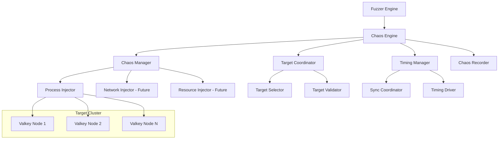
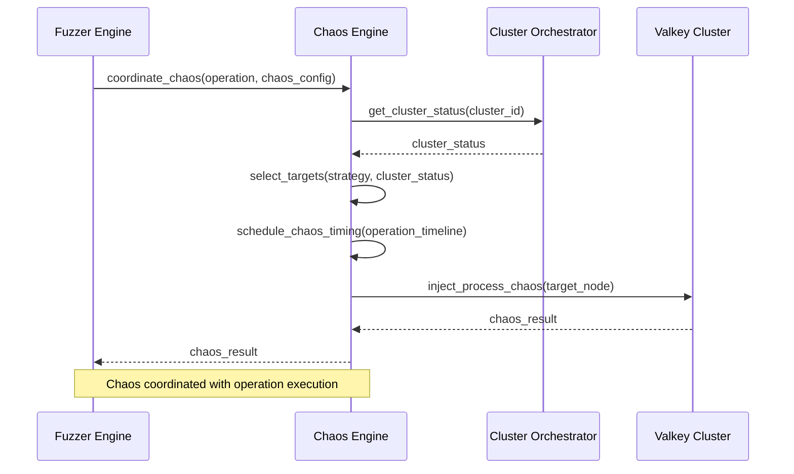

# Chaos Engine Detailed Design Document

## Overview

The Chaos Engine is a critical component of the Cluster Bus Fuzzer responsible for **failure injection** and **chaos coordination**. The Chaos Engine injects failures (like process kills) that can trigger or interfere with those operations, testing the cluster's resilience under adverse conditions.

## Architecture & Responsibilities

### Core Responsibility
**Inject controlled failures into the Valkey cluster to test robustness and recovery mechanisms**

### Key Distinction
- **Chaos Engine**: Injects failures (kills processes, network issues, etc.)
- **Operation Orchestrator**: Executes cluster operations (failover, resharding, etc.)
- **Coordination**: These two work together to create realistic failure scenarios

## Component Architecture



## Core Modules

### 1. Chaos Manager
**Central coordinator for all chaos injection activities**

#### Responsibilities:
- Orchestrates different types of chaos injection
- Manages chaos lifecycle (start, monitor, stop, cleanup)
- Coordinates with Fuzzer Engine for operation synchronization
- Maintains active chaos registry

#### Key Methods:
```python
class ChaosManager:
    def inject_chaos(self, chaos_config: ChaosConfig, target_nodes: List[NodeInfo]) -> ChaosResult
    def stop_chaos(self, chaos_id: str) -> bool
    def cleanup_all_chaos(self, cluster_id: str) -> bool
    def get_active_chaos(self, cluster_id: str) -> List[ChaosResult]
    def coordinate_with_operation(self, operation: Operation, chaos_config: ChaosConfig) -> ChaosResult
```

### 2. Process Injector (Initial Implementation)
**Handles process-level failure injection**

#### Chaos Types:
- **SIGKILL**: Immediate process termination (simulates crash)
- **SIGTERM**: Graceful process termination (simulates shutdown)
- **SIGSTOP/SIGCONT**: Process suspension/resumption (simulates temporary freeze)

#### Implementation Strategy:
```python
class ProcessInjector:
    def kill_process(self, node_info: NodeInfo, signal_type: ProcessChaosType) -> ChaosResult
    def suspend_process(self, node_info: NodeInfo, duration: float) -> ChaosResult
    def restart_process(self, node_info: NodeInfo, delay: float) -> ChaosResult
    def validate_process_state(self, node_info: NodeInfo) -> ProcessState
```

#### Process Management:
- Track Valkey process PIDs for each cluster node
- Monitor process health and restart status
- Handle process cleanup and zombie prevention
- Manage process restart with original configuration

### 3. Target Coordinator
**Manages chaos target selection and validation**

#### Target Selection Strategies:
```python
class TargetSelectionStrategy(Enum):
    RANDOM = "random"              # Random node selection
    PRIMARY_ONLY = "primary_only"  # Only target primary nodes
    REPLICA_ONLY = "replica_only"  # Only target replica nodes
    SPECIFIC = "specific"          # Target specific nodes
    WEIGHTED = "weighted"          # Weighted selection based on role/load
    CASCADING = "cascading"        # Sequential failure injection
```

#### Selection Logic:
```python
class TargetCoordinator:
    def select_targets(self, strategy: TargetSelectionStrategy, 
                      cluster_status: ClusterStatus, 
                      count: int = 1) -> List[NodeInfo]
    
    def validate_target_eligibility(self, node: NodeInfo, chaos_type: ChaosType) -> bool
    def get_target_impact_analysis(self, targets: List[NodeInfo]) -> ImpactAnalysis
    def ensure_cluster_viability(self, targets: List[NodeInfo], cluster_status: ClusterStatus) -> bool
```

#### Safety Mechanisms:
- **Minimum Viable Cluster**: Ensure enough nodes remain for cluster operation
- **Slot Coverage**: Prevent chaos that would leave slots uncovered
- **Quorum Protection**: Maintain cluster quorum during chaos injection
- **Cascade Prevention**: Avoid chaos combinations that could destroy cluster

### 4. Timing Manager
**Coordinates chaos timing with cluster operations**

#### Coordination Modes:
```python
class ChaosCoordinationMode(Enum):
    BEFORE_OPERATION = "before"    # Inject chaos before operation starts
    DURING_OPERATION = "during"    # Inject chaos while operation executes
    AFTER_OPERATION = "after"      # Inject chaos after operation completes
    INDEPENDENT = "independent"    # Chaos independent of operations
    INTERLEAVED = "interleaved"    # Multiple chaos events during operation
```

#### Timing Coordination:
```python
class TimingManager:
    def coordinate_chaos_with_operation(self, operation: Operation, 
                                      chaos_config: ChaosConfig) -> ChaosSchedule
    
    def schedule_chaos_event(self, chaos_config: ChaosConfig, 
                           operation_timeline: OperationTimeline) -> ChaosEvent
    
    def monitor_operation_progress(self, operation_id: str) -> OperationProgress
    def trigger_scheduled_chaos(self, chaos_event: ChaosEvent) -> ChaosResult
```

#### Timing Scenarios:
- **Pre-Operation Chaos**: Kill primary before failover to test detection
- **Mid-Operation Chaos**: Kill nodes during slot migration
- **Post-Operation Chaos**: Inject failures during recovery validation
- **Continuous Chaos**: Ongoing background failures during operations

### 5. Chaos Recorder
**Tracks and logs all chaos activities**

#### Recording Capabilities:
```python
class ChaosRecorder:
    def record_chaos_start(self, chaos_config: ChaosConfig, targets: List[NodeInfo]) -> str
    def record_chaos_progress(self, chaos_id: str, progress: ChaosProgress) -> None
    def record_chaos_completion(self, chaos_id: str, result: ChaosResult) -> None
    def record_chaos_failure(self, chaos_id: str, error: ChaosError) -> None
    def generate_chaos_report(self, cluster_id: str) -> ChaosReport
```

#### Metrics Tracked:
- Chaos injection success/failure rates
- Target node recovery times
- Cluster impact duration
- Operation interference patterns
- Recovery convergence metrics

## Interaction with Other Components

### 1. Fuzzer Engine Integration

#### Command Flow:


#### Coordination Points:
- **Test Scenario Planning**: Chaos Engine receives chaos configuration from Fuzzer Engine
- **Operation Synchronization**: Timing Manager coordinates with Operation Orchestrator
- **State Validation**: Chaos results feed into cluster state validation
- **Error Handling**: Chaos failures reported back to Fuzzer Engine for test adaptation

### 2. Cluster Orchestrator Integration

#### Information Exchange:
```python
# Chaos Engine queries Cluster Orchestrator for:
cluster_status = cluster_orchestrator.get_cluster_status(cluster_id)
node_info = cluster_orchestrator.get_node_info(cluster_id)
node_processes = cluster_orchestrator.get_node_processes(cluster_id)

# Chaos Engine notifies Cluster Orchestrator of:
cluster_orchestrator.notify_node_failure(node_id, failure_type)
cluster_orchestrator.request_node_restart(node_id, restart_config)
```

#### Coordination Scenarios:
- **Node Discovery**: Get current node PIDs and process information
- **Health Monitoring**: Report chaos-induced node failures
- **Recovery Coordination**: Coordinate node restart after chaos injection
- **State Synchronization**: Ensure cluster state consistency after chaos

### 3. Valkey Client Integration

#### Workload Impact Monitoring:
```python
# Monitor workload impact during chaos:
workload_metrics_before = valkey_client.get_workload_metrics(session_id)
chaos_result = chaos_engine.inject_chaos(chaos_config, targets)
workload_metrics_after = valkey_client.get_workload_metrics(session_id)

impact_analysis = analyze_workload_impact(workload_metrics_before, 
                                        workload_metrics_after, 
                                        chaos_result)
```

## Data Models

### Chaos Configuration
```python
@dataclass
class ChaosConfig:
    chaos_type: ChaosType
    target_selection: TargetSelection
    timing: ChaosTiming
    coordination: ChaosCoordination
    process_chaos_type: Optional[ProcessChaosType] = None
    safety_constraints: SafetyConstraints = None

@dataclass
class TargetSelection:
    strategy: TargetSelectionStrategy
    count: int = 1
    specific_nodes: Optional[List[str]] = None
    exclude_nodes: Optional[List[str]] = None
    role_filter: Optional[NodeRole] = None

@dataclass
class ChaosTiming:
    delay_before_operation: float = 0.0
    delay_after_operation: float = 0.0
    chaos_duration: float = 10.0
    max_chaos_duration: float = 60.0
    recovery_timeout: float = 30.0

@dataclass
class ChaosCoordination:
    coordinate_with_operation: bool = True
    coordination_mode: ChaosCoordinationMode = ChaosCoordinationMode.DURING_OPERATION
    wait_for_operation_start: bool = True
    stop_on_operation_complete: bool = False
```

### Chaos Results
```python
@dataclass
class ChaosResult:
    chaos_id: str
    chaos_type: ChaosType
    target_nodes: List[str]
    success: bool
    start_time: float
    end_time: Optional[float] = None
    error_message: Optional[str] = None
    impact_metrics: Optional[ChaosImpactMetrics] = None
    recovery_metrics: Optional[RecoveryMetrics] = None

@dataclass
class ChaosImpactMetrics:
    nodes_affected: int
    slots_affected: List[int]
    client_errors_induced: int
    cluster_downtime: float
    data_loss_detected: bool

@dataclass
class RecoveryMetrics:
    recovery_start_time: float
    recovery_complete_time: float
    nodes_recovered: int
    manual_intervention_required: bool
    cluster_state_restored: bool
```

## Safety Mechanisms

### 1. Cluster Viability Protection
```python
class SafetyConstraints:
    min_primary_nodes: int = 1
    min_total_nodes: int = 3
    max_simultaneous_failures: int = 1
    preserve_quorum: bool = True
    ensure_slot_coverage: bool = True
    max_chaos_duration: float = 300.0  # 5 minutes max
```

### 2. Chaos Validation
```python
def validate_chaos_safety(chaos_config: ChaosConfig, 
                         cluster_status: ClusterStatus) -> ValidationResult:
    """
    Validate that chaos injection won't destroy cluster viability
    """
    # Check minimum node requirements
    # Validate slot coverage after chaos
    # Ensure quorum maintenance
    # Check for cascading failure risks
```

### 3. Emergency Recovery
```python
class EmergencyRecovery:
    def detect_cluster_failure(self, cluster_id: str) -> bool
    def emergency_stop_all_chaos(self, cluster_id: str) -> bool
    def attempt_cluster_recovery(self, cluster_id: str) -> RecoveryResult
    def escalate_to_manual_intervention(self, cluster_id: str, error: str) -> None
```

## Implementation Phases

### Phase 1: Basic Process Chaos (Current)
- Process kill injection (SIGKILL, SIGTERM)
- Basic target selection (random, role-based)
- Simple timing coordination
- Basic safety constraints

### Phase 2: Advanced Process Chaos
- Process suspension/resumption
- Gradual process degradation
- Resource exhaustion simulation
- Advanced target selection strategies

### Phase 3: Network Chaos (Future)
- Network partition injection
- Packet loss simulation
- Latency injection
- Bandwidth throttling

### Phase 4: Resource Chaos (Future)
- Memory pressure simulation
- Disk I/O throttling
- CPU starvation
- File system corruption

## Error Handling & Recovery

### Chaos Injection Failures
```python
class ChaosError(Exception):
    def __init__(self, chaos_id: str, error_type: ChaosErrorType, message: str):
        self.chaos_id = chaos_id
        self.error_type = error_type
        self.message = message

class ChaosErrorType(Enum):
    TARGET_NOT_FOUND = "target_not_found"
    PERMISSION_DENIED = "permission_denied"
    PROCESS_ALREADY_DEAD = "process_already_dead"
    SAFETY_VIOLATION = "safety_violation"
    TIMING_CONFLICT = "timing_conflict"
```

### Recovery Strategies
- **Graceful Degradation**: Continue testing with reduced chaos scope
- **Automatic Retry**: Retry failed chaos injection with different parameters
- **Alternative Targets**: Switch to backup targets if primary targets fail
- **Emergency Abort**: Stop all chaos if cluster viability is threatened

## Testing Strategy

### Unit Testing
- Individual chaos injector components
- Target selection algorithms
- Timing coordination logic
- Safety constraint validation

### Integration Testing
- Chaos coordination with operations
- Multi-component failure scenarios
- Recovery mechanism validation
- Safety mechanism effectiveness

### Chaos Testing the Chaos Engine
- Inject failures into the Chaos Engine itself
- Test recovery from Chaos Engine failures
- Validate fail-safe mechanisms
- Test emergency stop procedures

This design provides a robust, safe, and extensible foundation for chaos engineering within the Cluster Bus Fuzzer, ensuring that failure injection enhances testing effectiveness while maintaining system safety and reliability.