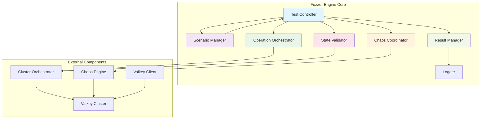
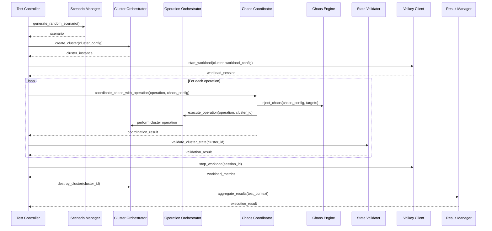
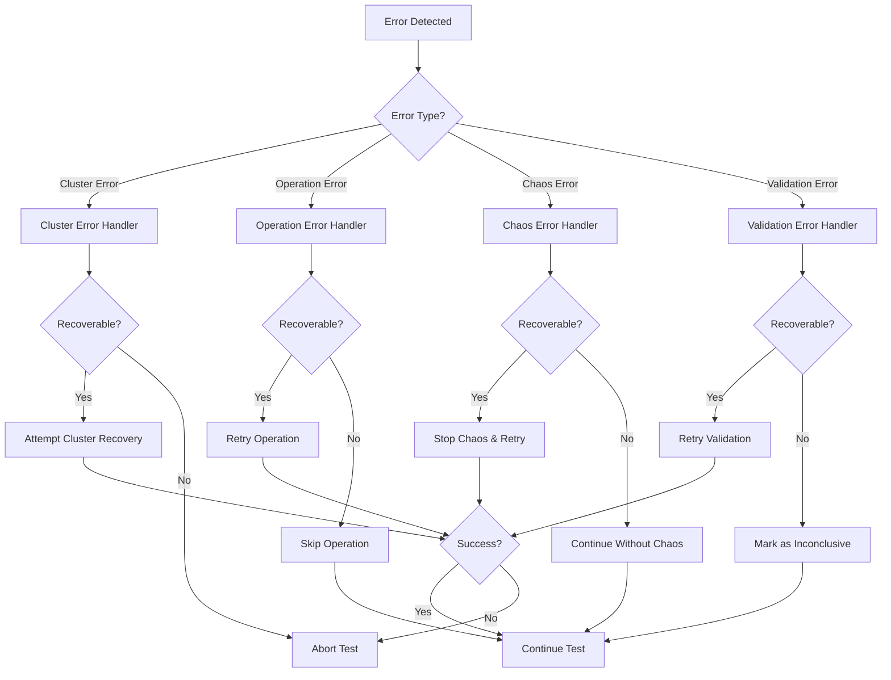

# Fuzzer Engine Detailed Design Document

## Overview

The Fuzzer Engine is the **central orchestrator** of the Cluster Bus Fuzzer system. It coordinates all testing activities, manages component interactions, and ensures comprehensive validation of Valkey cluster bus robustness. Unlike other components that have specialized responsibilities, the Fuzzer Engine serves as the "conductor" that orchestrates the entire testing symphony.

## Core Responsibilities

### Primary Functions
1. **Test Orchestration**: Coordinate end-to-end test execution across all components
2. **Scenario Management**: Generate, parse, and execute test scenarios
3. **Component Coordination**: Manage interactions between Cluster Orchestrator, Chaos Engine, and Valkey Client
4. **State Validation**: Ensure cluster state consistency and correctness throughout testing
5. **Result Aggregation**: Collect, analyze, and report comprehensive test results

### Key Principle
**The Fuzzer Engine owns the test lifecycle but delegates specialized tasks to other components**

## Architecture Overview



## Core Modules

### 1. Test Controller
**The central command center that orchestrates entire test execution**

#### Responsibilities:
- Manage test lifecycle from initialization to completion
- Coordinate between all internal modules
- Handle test execution flow control
- Manage error recovery and test adaptation

#### Key Methods:
```python
class TestController:
    def execute_test_scenario(self, scenario: Scenario) -> ExecutionResult:
        """Execute a complete test scenario end-to-end"""
        
    def execute_dsl_test(self, dsl_config: DSLConfig) -> ExecutionResult:
        """Execute DSL-based test configuration"""
        
    def generate_and_execute_random_test(self, seed: Optional[int] = None) -> ExecutionResult:
        """Generate and execute randomized test scenario"""
        
    def validate_and_execute(self, scenario: Scenario) -> ExecutionResult:
        """Validate scenario before execution and run if valid"""
        
    def handle_test_interruption(self, test_id: str, reason: str) -> InterruptionResult:
        """Handle test interruptions and cleanup"""
```

#### Execution Flow:
```python
def execute_test_scenario(self, scenario: Scenario) -> ExecutionResult:
    # 1. Initialize test environment
    test_context = self._initialize_test_context(scenario)
    
    # 2. Create and validate cluster
    cluster = self._setup_cluster(scenario.cluster_config)
    
    # 3. Start workload if configured
    workload_session = self._start_workload(cluster, scenario.workload_config)
    
    # 4. Execute operations with chaos coordination
    for operation in scenario.operations:
        operation_result = self._execute_coordinated_operation(
            operation, scenario.chaos_config, cluster
        )
        test_context.add_operation_result(operation_result)
    
    # 5. Perform final validation
    final_validation = self._perform_comprehensive_validation(cluster, scenario.validation_config)
    
    # 6. Cleanup and generate results
    self._cleanup_test_environment(cluster, workload_session)
    return self._generate_execution_result(test_context, final_validation)
```

### 2. Scenario Manager
**Handles test scenario generation, parsing, and validation**

#### Core Functions:

**Random Scenario Generation**:
```python
class ScenarioManager:
    def generate_random_scenario(self, seed: Optional[int] = None, 
                               constraints: ScenarioConstraints = None) -> Scenario:
        """Generate randomized test scenario with optional constraints"""
        
    def generate_failover_scenario(self, cluster_size: int, chaos_intensity: float) -> Scenario:
        """Generate scenario focused on failover testing"""
        
    def generate_stress_scenario(self, duration: int, operation_frequency: float) -> Scenario:
        """Generate high-stress testing scenario"""
```

**DSL Configuration Parsing**:
```python
    def parse_dsl_config(self, dsl_text: str) -> Scenario:
        """Parse DSL configuration into executable scenario"""
        
    def validate_dsl_syntax(self, dsl_text: str) -> ValidationResult:
        """Validate DSL syntax before parsing"""
        
    def convert_scenario_to_dsl(self, scenario: Scenario) -> str:
        """Convert scenario back to DSL for reproducibility"""
```

**Scenario Validation**:
```python
    def validate_scenario(self, scenario: Scenario) -> ScenarioValidationResult:
        """Comprehensive scenario validation"""
        
    def check_scenario_feasibility(self, scenario: Scenario) -> FeasibilityResult:
        """Check if scenario can be executed with available resources"""
        
    def optimize_scenario(self, scenario: Scenario) -> Scenario:
        """Optimize scenario for better test coverage or performance"""
```

#### Random Generation Logic:
```python
def generate_random_scenario(self, seed: Optional[int] = None) -> Scenario:
    rng = Random(seed) if seed else Random()
    
    # Generate cluster configuration
    shard_count = rng.randint(3, 16)
    replica_count = rng.randint(0, 2)
    cluster_config = self._generate_cluster_config(shard_count, replica_count)
    
    # Generate operations sequence
    operation_count = rng.randint(1, 5)
    operations = []
    for _ in range(operation_count):
        operation = self._generate_random_operation(cluster_config, rng)
        operations.append(operation)
    
    # Generate chaos configuration
    chaos_config = self._generate_chaos_config(operations, rng)
    
    # Generate validation configuration
    validation_config = self._generate_validation_config(rng)
    
    return Scenario(
        scenario_id=f"random-{int(time.time())}-{rng.randint(1000, 9999)}",
        cluster_config=cluster_config,
        operations=operations,
        chaos_config=chaos_config,
        validation_config=validation_config,
        seed=seed
    )
```

### 3. Operation Orchestrator
**Manages cluster operation execution and coordination**

#### Operation Types:
```python
class OperationType(Enum):
    FAILOVER = "failover"
    # Future extensions:
    # ADD_REPLICA = "add_replica"
    # REMOVE_REPLICA = "remove_replica"
    # RESHARD = "reshard"
    # SCALE_OUT = "scale_out"
    # SCALE_IN = "scale_in"
```

#### Core Methods:
```python
class OperationOrchestrator:
    def execute_operation(self, operation: Operation, cluster_id: str) -> OperationResult:
        """Execute a single cluster operation"""
        
    def execute_coordinated_operation(self, operation: Operation, 
                                    chaos_config: ChaosConfig, 
                                    cluster_id: str) -> CoordinatedOperationResult:
        """Execute operation with chaos coordination"""
        
    def validate_operation_preconditions(self, operation: Operation, 
                                       cluster_status: ClusterStatus) -> bool:
        """Validate that operation can be safely executed"""
        
    def monitor_operation_progress(self, operation_id: str) -> OperationProgress:
        """Monitor ongoing operation execution"""
        
    def rollback_operation(self, operation_id: str) -> RollbackResult:
        """Attempt to rollback failed operation"""
```

#### Failover Operation Implementation:
```python
def execute_failover_operation(self, operation: Operation, cluster_id: str) -> OperationResult:
    # 1. Validate preconditions
    cluster_status = self.cluster_orchestrator.get_cluster_status(cluster_id)
    if not self._validate_failover_preconditions(operation, cluster_status):
        return OperationResult(success=False, error="Preconditions not met")
    
    # 2. Identify target node and replica
    target_node = self._find_target_node(operation.target_node, cluster_status)
    replica_node = self._select_failover_replica(target_node, cluster_status)
    
    # 3. Execute failover sequence
    try:
        # Initiate failover
        failover_result = self._initiate_failover(target_node, replica_node)
        
        # Wait for completion
        self._wait_for_failover_completion(target_node, replica_node, operation.timing.timeout)
        
        # Validate result
        post_failover_status = self.cluster_orchestrator.get_cluster_status(cluster_id)
        validation_result = self._validate_failover_result(post_failover_status, target_node, replica_node)
        
        return OperationResult(
            success=True,
            operation_id=operation.operation_id,
            duration=time.time() - start_time,
            details=failover_result
        )
        
    except OperationTimeout:
        return OperationResult(success=False, error="Failover timeout")
    except OperationError as e:
        return OperationResult(success=False, error=str(e))
```

### 4. Chaos Coordinator
**Manages chaos injection coordination with operations**

#### Coordination Strategies:
```python
class ChaosCoordinator:
    def coordinate_chaos_with_operation(self, operation: Operation, 
                                      chaos_config: ChaosConfig) -> ChaosCoordinationResult:
        """Coordinate chaos injection with operation execution"""
        
    def schedule_chaos_events(self, operations: List[Operation], 
                            chaos_config: ChaosConfig) -> List[ChaosEvent]:
        """Schedule multiple chaos events across operation sequence"""
        
    def monitor_chaos_impact(self, chaos_id: str, operation_id: str) -> ChaosImpactReport:
        """Monitor how chaos affects operation execution"""
        
    def emergency_stop_chaos(self, cluster_id: str, reason: str) -> EmergencyStopResult:
        """Emergency stop all chaos injection"""
```

#### Coordination Flow:
```python
def coordinate_chaos_with_operation(self, operation: Operation, chaos_config: ChaosConfig) -> ChaosCoordinationResult:
    coordination_plan = self._create_coordination_plan(operation, chaos_config)
    
    results = []
    
    # Pre-operation chaos
    if coordination_plan.chaos_before_operation:
        pre_chaos = self.chaos_engine.inject_chaos(
            chaos_config, 
            coordination_plan.pre_operation_targets
        )
        results.append(pre_chaos)
        time.sleep(chaos_config.timing.delay_before_operation)
    
    # Start operation
    operation_future = self._start_operation_async(operation)
    
    # During-operation chaos
    if coordination_plan.chaos_during_operation:
        # Wait for operation to reach target state
        self._wait_for_operation_milestone(operation_future, coordination_plan.chaos_trigger_milestone)
        
        during_chaos = self.chaos_engine.inject_chaos(
            chaos_config,
            coordination_plan.during_operation_targets
        )
        results.append(during_chaos)
    
    # Wait for operation completion
    operation_result = operation_future.get(timeout=operation.timing.timeout)
    
    # Post-operation chaos
    if coordination_plan.chaos_after_operation:
        time.sleep(chaos_config.timing.delay_after_operation)
        post_chaos = self.chaos_engine.inject_chaos(
            chaos_config,
            coordination_plan.post_operation_targets
        )
        results.append(post_chaos)
    
    return ChaosCoordinationResult(
        operation_result=operation_result,
        chaos_results=results,
        coordination_effectiveness=self._analyze_coordination_effectiveness(operation_result, results)
    )
```

### 5. State Validator
**Comprehensive cluster state validation and consistency checking**

#### Validation Categories:
```python
class StateValidator:
    def validate_cluster_state(self, cluster_id: str, 
                             validation_config: ValidationConfig) -> ValidationResult:
        """Perform comprehensive cluster state validation"""
        
    def validate_slot_coverage(self, cluster_status: ClusterStatus) -> SlotValidationResult:
        """Validate all 16384 slots are properly assigned"""
        
    def validate_replica_synchronization(self, cluster_status: ClusterStatus) -> ReplicationValidationResult:
        """Validate replica synchronization and lag"""
        
    def validate_data_consistency(self, cluster_status: ClusterStatus) -> ConsistencyValidationResult:
        """Validate data consistency across cluster nodes"""
        
    def validate_node_connectivity(self, cluster_status: ClusterStatus) -> ConnectivityValidationResult:
        """Validate cluster bus connectivity between nodes"""
```

#### Comprehensive Validation Flow:
```python
def validate_cluster_state(self, cluster_id: str, validation_config: ValidationConfig) -> ValidationResult:
    validation_start = time.time()
    results = {}
    
    # Get current cluster status
    cluster_status = self.cluster_orchestrator.get_cluster_status(cluster_id)
    
    # Slot coverage validation
    if validation_config.check_slot_coverage:
        results['slot_coverage'] = self.validate_slot_coverage(cluster_status)
    
    # Slot conflict detection
    if validation_config.check_slot_conflicts:
        results['slot_conflicts'] = self.detect_slot_conflicts(cluster_status)
    
    # Replica synchronization
    if validation_config.check_replica_sync:
        results['replica_sync'] = self.validate_replica_synchronization(cluster_status)
    
    # Node connectivity
    if validation_config.check_node_connectivity:
        results['connectivity'] = self.validate_node_connectivity(cluster_status)
    
    # Data consistency
    if validation_config.check_data_consistency:
        results['data_consistency'] = self.validate_data_consistency(cluster_status)
    
    # Wait for convergence if needed
    if not all(r.passed for r in results.values()):
        convergence_result = self._wait_for_convergence(
            cluster_id, 
            validation_config.convergence_timeout
        )
        results['convergence'] = convergence_result
    
    validation_end = time.time()
    
    return ValidationResult(
        cluster_id=cluster_id,
        validation_timestamp=validation_end,
        validation_duration=validation_end - validation_start,
        results=results,
        overall_success=all(r.passed for r in results.values())
    )
```

### 6. Result Manager
**Aggregates and analyzes test results**

#### Result Aggregation:
```python
class ResultManager:
    def aggregate_test_results(self, test_context: TestContext) -> ExecutionResult:
        """Aggregate all test results into final execution result"""
        
    def analyze_test_effectiveness(self, execution_result: ExecutionResult) -> EffectivenessAnalysis:
        """Analyze how effective the test was at finding issues"""
        
    def compare_test_results(self, results: List[ExecutionResult]) -> ComparisonReport:
        """Compare multiple test results for patterns"""
        
    def generate_test_summary(self, execution_result: ExecutionResult) -> TestSummary:
        """Generate human-readable test summary"""
```

### 7. Logger
**Comprehensive logging and audit trail**

#### Logging Capabilities:
```python
class Logger:
    def log_test_start(self, scenario: Scenario) -> None:
        """Log test scenario initiation"""
        
    def log_operation_execution(self, operation: Operation, result: OperationResult) -> None:
        """Log operation execution details"""
        
    def log_chaos_coordination(self, chaos_result: ChaosCoordinationResult) -> None:
        """Log chaos coordination activities"""
        
    def log_validation_result(self, validation_result: ValidationResult) -> None:
        """Log cluster state validation results"""
        
    def log_test_completion(self, execution_result: ExecutionResult) -> None:
        """Log test completion and final results"""
        
    def generate_audit_trail(self, test_id: str) -> AuditTrail:
        """Generate complete audit trail for test execution"""
```

## Component Interaction Patterns

### 1. Test Execution Flow



### 2. Error Handling and Recovery



### 3. State Management

#### Test Context Management:
```python
@dataclass
class TestContext:
    test_id: str
    scenario: Scenario
    cluster_instance: ClusterInstance
    workload_session: Optional[WorkloadSession]
    operation_results: List[OperationResult]
    chaos_results: List[ChaosResult]
    validation_results: List[ValidationResult]
    start_time: float
    current_phase: TestPhase
    error_log: List[TestError]
    
    def add_operation_result(self, result: OperationResult) -> None:
        self.operation_results.append(result)
        
    def add_chaos_result(self, result: ChaosResult) -> None:
        self.chaos_results.append(result)
        
    def add_validation_result(self, result: ValidationResult) -> None:
        self.validation_results.append(result)
        
    def record_error(self, error: TestError) -> None:
        self.error_log.append(error)
        
    def get_current_cluster_status(self) -> ClusterStatus:
        return self.cluster_instance.get_status()
```

## Advanced Features

### 1. Adaptive Testing
```python
class AdaptiveTesting:
    def adapt_scenario_based_on_results(self, current_scenario: Scenario, 
                                      partial_results: List[OperationResult]) -> Scenario:
        """Adapt test scenario based on intermediate results"""
        
    def increase_chaos_intensity(self, chaos_config: ChaosConfig, 
                               effectiveness_score: float) -> ChaosConfig:
        """Increase chaos intensity if test is too easy"""
        
    def reduce_operation_complexity(self, operations: List[Operation], 
                                  failure_rate: float) -> List[Operation]:
        """Reduce complexity if failure rate is too high"""
```

### 2. Parallel Test Execution
```python
class ParallelTestManager:
    def execute_parallel_scenarios(self, scenarios: List[Scenario]) -> List[ExecutionResult]:
        """Execute multiple scenarios in parallel"""
        
    def manage_resource_allocation(self, active_tests: List[TestContext]) -> ResourceAllocation:
        """Manage resource allocation across parallel tests"""
        
    def coordinate_shared_resources(self, test_contexts: List[TestContext]) -> CoordinationResult:
        """Coordinate access to shared resources"""
```

### 3. Test Result Analytics
```python
class TestAnalytics:
    def analyze_failure_patterns(self, results: List[ExecutionResult]) -> FailurePatternAnalysis:
        """Analyze patterns in test failures"""
        
    def calculate_coverage_metrics(self, results: List[ExecutionResult]) -> CoverageMetrics:
        """Calculate test coverage metrics"""
        
    def generate_recommendations(self, analysis: FailurePatternAnalysis) -> List[TestRecommendation]:
        """Generate recommendations for improving test coverage"""
```

## Performance Considerations

### 1. Resource Management
- **Memory**: Efficient cluster state caching and result streaming
- **CPU**: Parallel validation and asynchronous operation execution
- **I/O**: Batched logging and efficient cluster communication

### 2. Scalability
- **Large Clusters**: Optimized algorithms for 16-shard clusters
- **Long Tests**: Streaming results and incremental validation
- **High Frequency**: Efficient operation queuing and execution

### 3. Reliability
- **Fault Tolerance**: Graceful degradation on component failures
- **Recovery**: Automatic recovery from transient failures
- **Consistency**: Strong consistency guarantees for test results

This comprehensive design ensures the Fuzzer Engine can effectively orchestrate complex cluster testing scenarios while maintaining reliability, performance, and extensibility for future enhancements.